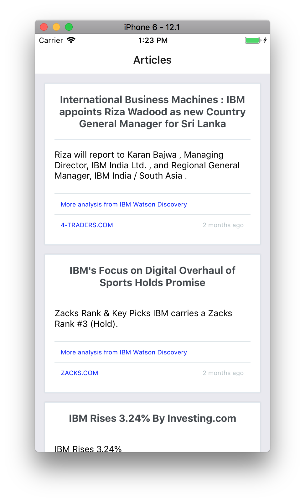
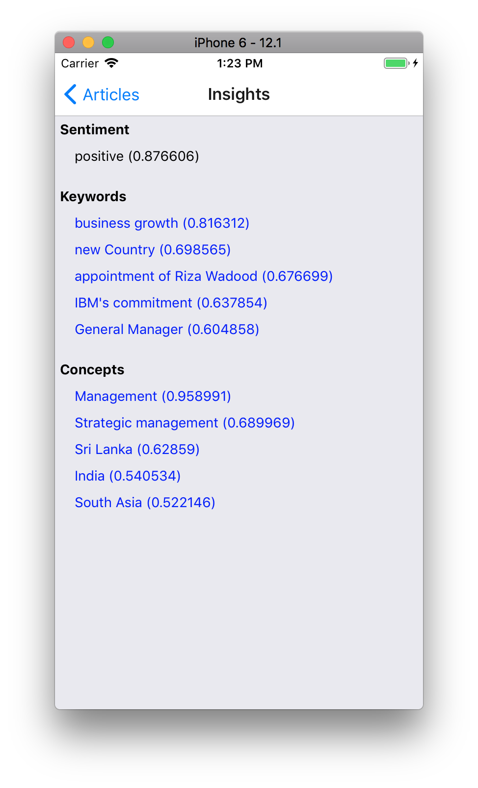
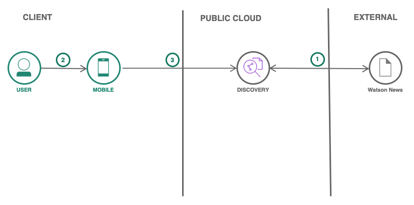
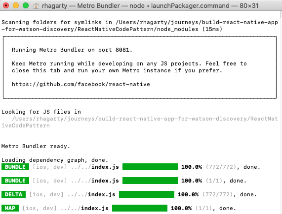
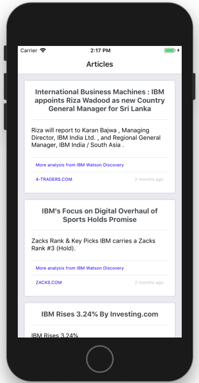
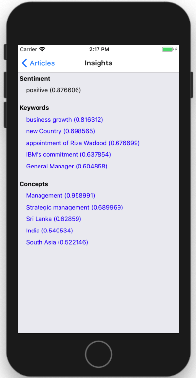
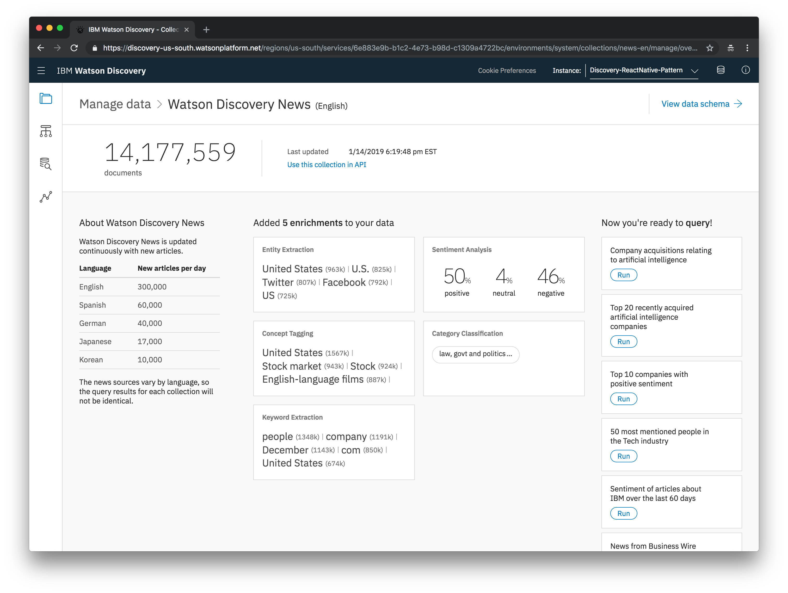

[](https://travis-ci.org/IBM/build-react-native-app-for-watson-discovery)

# Build a cross-platform mobile app to search company news and gain insights

Get started building a cross-platform mobile app using React Native to fetch news on a company and gain insights using Watson Discovery.

Create a cross-platform mobile app that fetches news for a specific company. The application uses Watson Discovery to get news articles with sentiment, keywords, and related concepts. This application is easily customizable and provides a starting point to use Watson Discovery in your own React Native applications.

Following completion of this pattern, the developer will understand how to:

* Create a cross-platform mobile application using React Native
* Use Watson Discovery to detect sentiment and keywords for articles
* Use Watson Discovery to find additional, related news articles for each associated keyword

|   |   |
| - | - |
|  |  |



## Flow

1. Watson News data is loaded into the Watson Discovery service collection.
1. The user interacts with the Watson Discovery service via the React Native mobile app UI running in the XCode iOS Simulator.
1. The initial load of the mobile app will pull up recent, relevant articles for a company. The user can then click on insights to get sentiment, keywords, and concepts from Watson Discovery for any specific article.

## Included components

* [IBM Watson Discovery](https://www.ibm.com/watson/developercloud/discovery.html): A cognitive search and content analytics engine for applications to identify patterns, trends, and actionable insights. Extract meta-data from returned content such as concepts, keywords, and sentiment using natural language understanding.

## Featured technologies

* [React Native](https://facebook.github.io/react-native/): React Native lets you build mobile apps using only JavaScript. It uses the same design as [React](https://reactjs.org/), letting you compose a rich mobile UI from declarative components.

# Watch the Video

[](https://www.youtube.com/watch?v=DxT3SYw1Jc8)

# Steps

> NOTE: This app requires that the following steps be performed on a Mac running the latest iOS version.

1. [Clone the repo](#1-clone-the-repo)
1. [Create IBM Cloud services](#2-create-ibm-cloud-services)
1. [Configure credentials](#3-configure-credentials)
1. [Run the application](#4-run-the-application)

## 1. Clone the repo

```bash
git clone https://github.com/IBM/build-react-native-app-for-watson-discovery
cd build-react-native-app-for-watson-discovery
```

Note that all of the `react-native` assets can be found in the `ReactNativeCodePattern` sub-directory. Set that as your current directory before executing the remaining steps.

```bash
cd ReactNativeCodePattern
```

> Extra: For convenience this sub-directory is included with this code pattern, but it is worth mentioning how it was created. It was built using the React Natvive command line interface:
>
>  ```bash
>  react-native init ReactNativeCodePattern
>  ```
>
> This creates the sub-directory and installs all of the required files needed to run `iOS` and `Android` React Native apps.
>
>For an overview of the project structure, including the React Native assets, please check out [DEVELOPING.md](DEVELOPING.md).

## 2. Create IBM Cloud services

* [**Watson Discovery**](https://cloud.ibm.com/catalog/services/discovery)

## 3. Configure credentials

Launch the **Watson Discovery** tool. The credentials for the service can be found by selecting the `Service Credentials` tab.

If no credentials exist, select the `New Credential` button to create a new set of credentials.

In the `Globals.js` file, add the `apikey` value to the `WATSON_DISCOVERY_CREDENTIAL` key using the following format: `'apikey:<your api key>'`.

## 4. Run the application

The `Node` app must be run using the XCode iOS Simulator.

* Install [Node.js](https://nodejs.org/en/) runtime or NPM.
* Install [Xcode](https://developer.apple.com/xcode/) using the `App Store` on your Mac.

Build and run the app using the following commands:

```bash
npm install
react-native run-ios
```

The `react-native run-ios` command performs several steps:

* It builds the required set-up files for your iOS React Native app. This can take a bit of time and a large amount of console messages will be output.
* It launches the application on the `XCode iOS Simulator`. If not already running, this command will launch the simulator using the last device settings.
* A `Metro Bundler` window will appear that show the progress of bundling all of the javascript files required to run the app.

The task is successfully complete once you see `Build Succeeded` in the console and the console prompt returns.

Here is how the `Metro Bundler` screen should appear:



# Sample Output

Your `iOS Simulator` screen should look simlar to this:



For each article found by Watson Discovery, you will see a title, a description, a link to some Discovery insights, and a link to the website that hosted the article.

> Note: To scroll the articles list, click and drag the mouse pointer up and down.

From the main screen, if you click on **More analysis from IBM Watson Discovery**, you will see the following:



Here you will see a `sentiment` score assigned to the article, as well as `Keywords` and `Concepts` that Watson Discovery has detected. Clicking on one of the links will generate a new list of articles associated with the selected item.

> Note: Click [here](https://www.ibm.com/cloud/garage/architectures/cognitiveDiscoveryDomain/overview) for more information about these enrichments generated by Watson Discovery.

From the main screen, if you click on the web site link for the article, the article will be displayed:


> Note: Use the `< ReactNativeCodePattern` link at the top of the panel to return to the main screen.

# Optional Steps

## Run the application on an Android virtual device

Run the following command to run in Android mode:

```bash
react-native run-android
```

This will require that you install either the `Android SDK` or `Android Studio` application. Once installed, click on the `Building Projects with Native Code` tab found [here](https://facebook.github.io/react-native/docs/getting-started.html) for details on how to run the mobile app on an Android virtual device.

## Run the application on a device

After the application is running in the iOS simulator, you can test it on an actual device. For iOS devices, see the [React Native official documentation](https://facebook.github.io/react-native/docs/running-on-device) for the required steps.

## Modify the company being searched by the app

As a default, `IBM` is the company used in the search query sent to Watson Discovery. To change this, you will need to modify the hard-coded search query string defined in the file [src/discovery.js](https://github.com/IBM/build-react-native-app-for-watson-discovery/blob/master/ReactNativeCodePattern/src/discovery.js).

Modify the `filter` value specified in the `url_dq1` string.

## Explore Watson Discovery News

The data being used by this mobile app comes from a `Discovery News` collection that is available to every Watson Discovery service created. To explore this data, you can use the tooling available from the [Watson Discovery](https://cloud.ibm.com/catalog/services/discovery) service panel.

Launch the **Watson Discovery** tool. Click on `Manage` tab, and then the `Launch Tool` button.

From the list of data collections, select `Watson Discovery News`. You should then see the following screen:



# Troubleshooting

* The `Metro Builder` window does not appear.

  > Try issuing the following command from the `ReactNativeCodePattern` directory to manually start it:

  ```bash
  react-native start
  ```

* The main `articles` panel is blank (i.e. no articles displayed).

  > This may be due to forgetting to add your Watson Discovery API key, as shown in `Step 3` above. If it has been added, verify the key is valid, and that the string in the correct format (`'apikey:<your api key>'`)

## Remote Debugging

Once the `iOS Simulator` screen is displayed, you can use remote debugging to monitor the application.

To enable debugging, select the `iOS Simulator` screen and press ***CMD+d***, then select option `Start Remote JS Debugging`, which should launch a new browser window. From there, click `inspect` (or similar command, depending on your browser) to bring up the developer tools window.

For more information on running the `XCode iOS Simulator`, from the Simulator menu bar, select `Help` > `Simulator Help`.

# Links

* [Watson Discovery Getting Started Tutorial](https://console.bluemix.net/docs/services/discovery/getting-started.html#getting-started-tutorial)
* [Watson Discovery API docs](https://console.bluemix.net/apidocs/discovery)
* [How to use XCode iOS Simulator for responsive web testing on Mac](https://medium.com/@ali.dev/how-to-use-xcode-ios-simulator-for-responsive-web-testing-on-mac-7870ee4fc22b)

# Learn more

* **Artificial Intelligence Code Patterns**: Enjoyed this Code Pattern? Check out our other [AI Code Patterns](https://developer.ibm.com/technologies/artificial-intelligence/)
* **AI and Data Code Pattern Playlist**: Bookmark our [playlist](https://www.youtube.com/playlist?list=PLzUbsvIyrNfknNewObx5N7uGZ5FKH0Fde) with all of our Code Pattern videos
* **With Watson**: Want to take your Watson app to the next level? Looking to utilize Watson Brand assets? [Join the With Watson program](https://www.ibm.com/watson/with-watson/) to leverage exclusive brand, marketing, and tech resources to amplify and accelerate your Watson embedded commercial solution.

# License

This code pattern is licensed under the Apache Software License, Version 2.  Separate third party code objects invoked within this code pattern are licensed by their respective providers pursuant to their own separate licenses. Contributions are subject to the [Developer Certificate of Origin, Version 1.1 (DCO)](https://developercertificate.org/) and the [Apache Software License, Version 2](https://www.apache.org/licenses/LICENSE-2.0.txt).

[Apache Software License (ASL) FAQ](https://www.apache.org/foundation/license-faq.html#WhatDoesItMEAN)
